# Develop Agentic AI Workflows with Langflow and Oracle Database MCP, Vector RAG, NL2SQL/”Select AI”, and AI Optimizer​

## Introduction

This solution will have you running Agentic AI Workflows with Langflow and Oracle Database MCP, Vector RAG, NL2SQL/”Select AI”, and AI Optimizer in no time.

This is possible for free using Oracle Database 26ai either in the cloud or using the container image, so be sure to check them out [here](https://www.oracle.com/database/free/).

As a bonus, we'll also show you how to create custom components and use custom models in Langflow, how to front your agentic AI system with an interactive Unreal metahuman avatar/hologram, and how to run your models, etc. on **NVIDIA GPUs** and Inference Microservices.

## 0. Prerequisites & Docs

### Prerequisites

- Oracle Database 26ai
- A Langflow account
- Python environment with dependencies installed (conda, venv...)

### Docs

- [Simplify Microservices with Converged Oracle Database](https://livelabs.oracle.com/pls/apex/r/dbpm/livelabs/view-workshop?wid=637)
- [Oracle AI Optimizer and Toolkit](https://github.com/oracle/ai-optimizer)

## 1. Getting started

In short, Langflow is the most popular (and open source) agentic AI workflow tool out there and is a darling of the Langchain (and Langraph) community, MCP is the USB of AI letting you hook up and call tools via LLM decisions etc. (you probably know more about that already so I’ll spare any intro beyond that), and Oracle Database is simply the best and most versatile database that ever was, especially now with all of its AI capabilities.

The example flow…

I’ll demo with a financial advisor/agent flow. One that you can ask *“advise me on my stock portfolio”*, *“purchase x shares of y”*, etc. Of course, these are made-up entries in a database, and you shouldn’t use this thing to manage your retirement. And overall, when using MCP and agents, you must be very careful to set up secure access and authorization, human in the loop, etc.

> **Note**: this financial advisor flow is also part of the new [Simplify Microservices with Converged Oracle Database](https://livelabs.oracle.com/pls/apex/r/dbpm/livelabs/view-workshop?wid=637) workshop, and all the flows can be found in the [flows/](./flows/) directory.

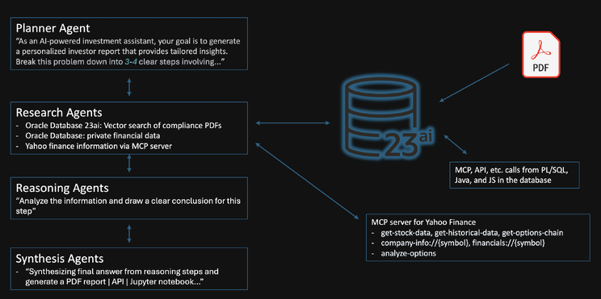

As anyone who works in agentic AI knows, there are MANY ways to set up these workflows/systems, however, one key aspect, and one that makes Oracle Database stand out so strongly, is the fact that the closer the context and meta of an agentic flow is to the data (and the less ETL and transport involved), the greater the quality, speed, simplicity, security, availability, and maintainability of the system.

We will show the various ways to access Oracle Database and its AI features, but will not be prescriptive about which one you choose. For example, you could call Vector RAG and NL2SQL/”Select AI” directly from the flow or via MCP or even the other way around, or use the AI Optimizer, etc., in various combinations. We will show you the most basic, discrete ways that are also extremely easy to extend.

Also, the ease of use of MCP can make it quite tempting to overcomplicate a system in an attempt to make it better/fancier, and so, while I am guilty of creating flows that call out to various market finance services, new feeds, social media, etc., each of these examples is a single agent, made as simple as possible. And in some cases, we will also show how to use local resources (eg, LLMs, embedding models, etc.) rather than yet another unnecessary network call, API key, etc., even if it’s to a free HuggingFace resource.

Ie, the example flows look less like this:

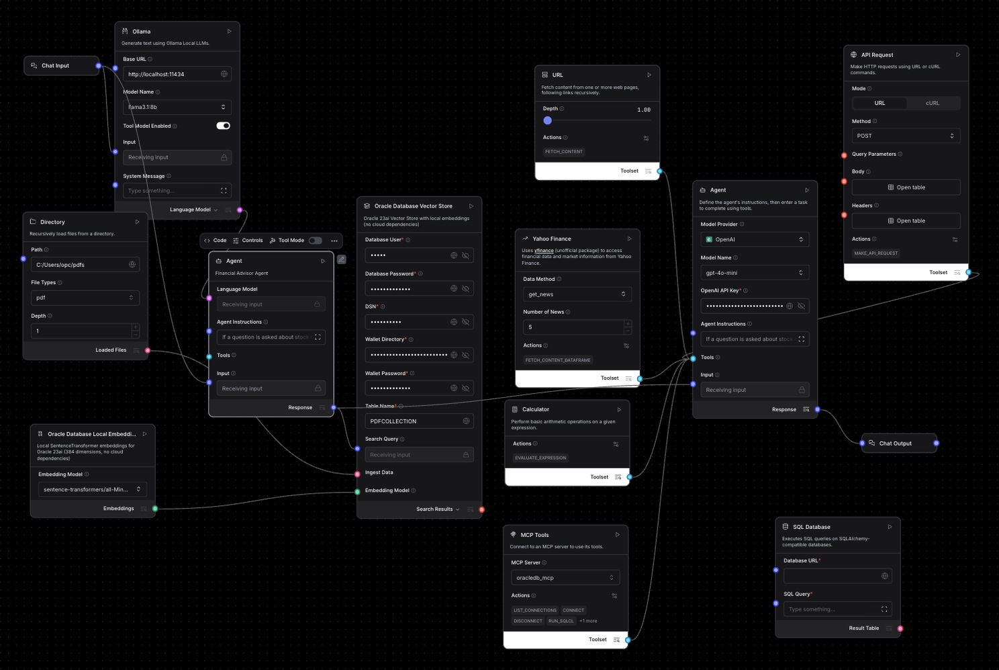

And more like this:

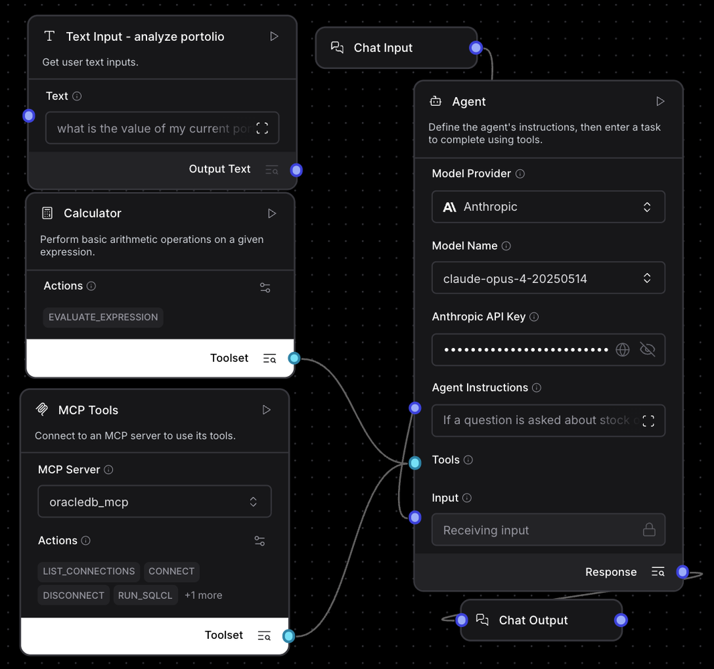

Alright, let’s get to it!

## 2. Langflow and Agents

Langflow installation is easy, but we mention the steps explicitly as, in my experience and others', you will need to install it just like this, being sure to use a devoted `venv` for isolation purposes, the `no-cache-dir` flag, etc.

```bash
# create virtual environment
python -m venv langflowenv
.\langflowenv\Scripts\activate
# install pip dependencies
python -m pip install --upgrade pip
uv pip install langflow --no-cache-dir
langflow run --host 0.0.0.0 --port 7860
```

Create an agentic AI flow. If creating a new flow, you may as well select the AI Agent template option you are presented with; otherwise, in the component menu on the left, just type “agent” then select the “+” next to “Agent” to create one:

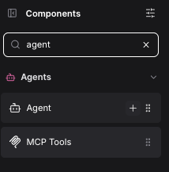

And you’ll have your agent template:

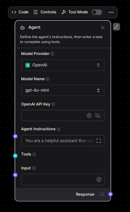

Note that an MCP server (or any tool) used in Langflow must be switched to “Tool Mode” to be plugged into and called by an agent:


## 3. Oracle Database 26ai MCP - Creation and configuration

Oracle Database has an MCP server, and you can read the doc [here.](https://docs.oracle.com/en/database/oracle/sql-developer-command-line/25.2/sqcug/starting-and-managing-sqlcl-mcp-server.html)

The Oracle SQL Developer VS Code extension is an extremely handy one-stop tool when working with Oracle Database, which is highly recommended regardless, but it is also an MCP server that allows LLMs with tooling calling capability to use it to do any number of operations on the database via natural language. SQLcl is the CLI for the Oracle Database, which is the actual core of the MCP server that the extension exposes, and can also be downloaded and installed separately.

Here is the screenshot of the Oracle SQL Developer extension:

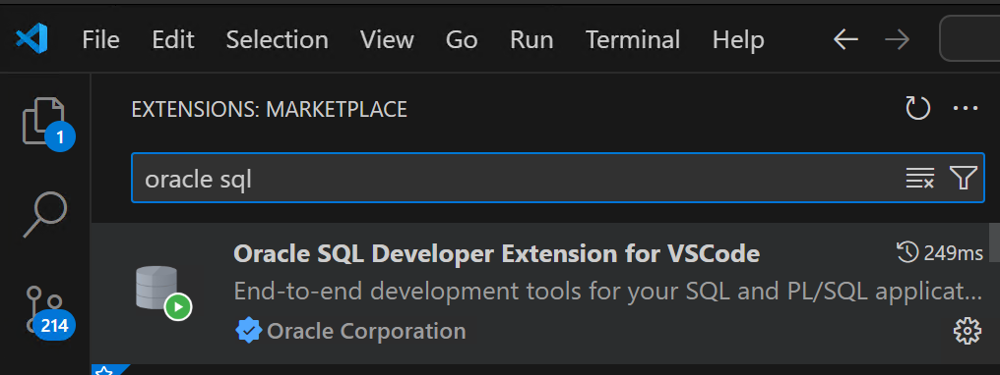

And here is an example of a connection created for an [Oracle Database 26ai container/image](https://www.oracle.com/database/free/):

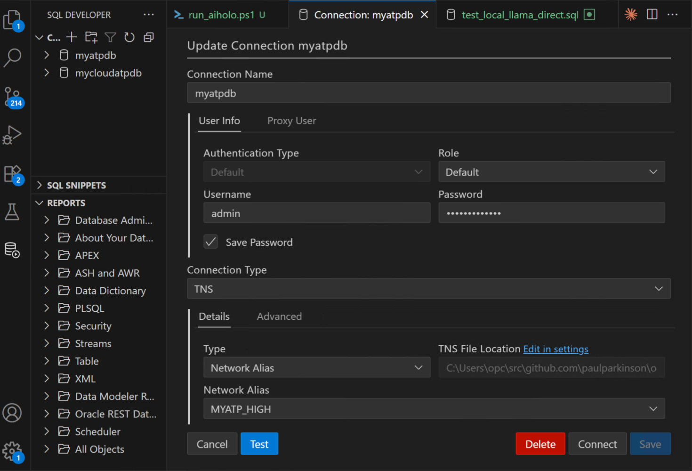

Here is an example of a connection created for an Oracle Database 26ai running in the cloud (whatever cloud that may be, since Oracle Database now runs in all of them):

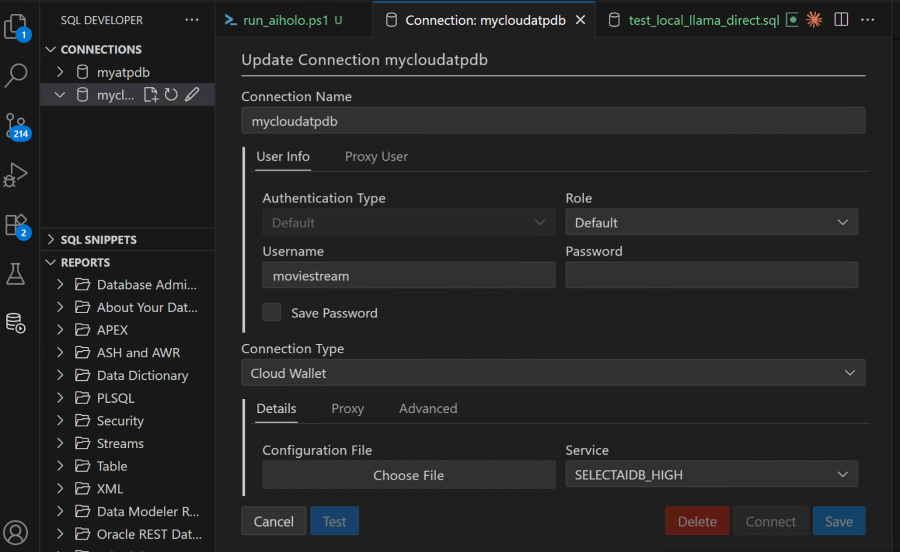

Notice the names given to them, `myatpdb` and `mycloudatpdb` as that is how you can refer to them when using MCP to connect. Here’s a quick screenshot to give you the idea of using it with copilot and sonnet in VS Code:

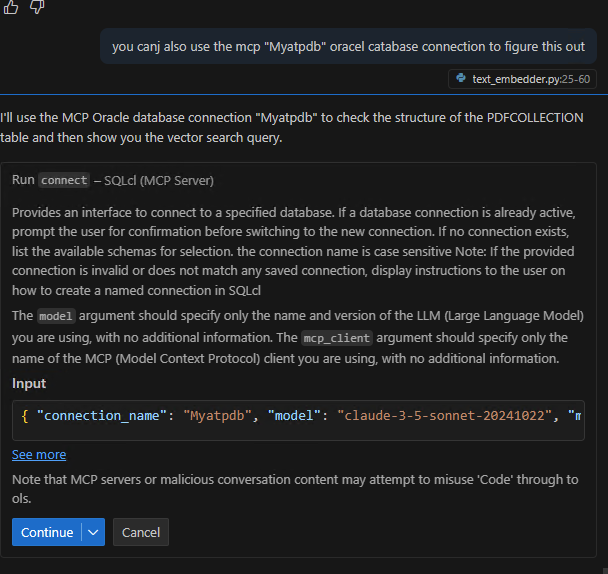

## 4. Oracle Database 26ai MCP - Usage

As you did to create an agent, in the component menu on the left of Langflow, type “agent” or “mcp” and select the “+” next to “MCP Tools” to create one:

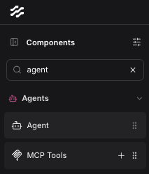

In the “MCP Tools” panel, select “MCP Server” and then “Add MCP Server”:

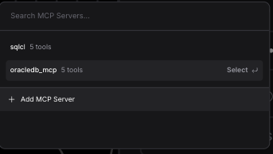

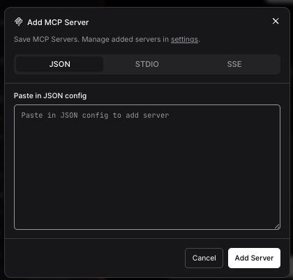

Then paste this in, making any mods to the path you need and forgoing the TNS_ADMIN entry/override if you don’t need it:

```bash
{
  "mcpServers": {
    "oracledb-mcp": {
      "command": "C:\\Users\\opc\\sqlcl\\bin\\sql",
      "args": ["-mcp"],
      "env": {
        "TNS_ADMIN": "C:\\Users\\opc\\src\\github.com\\paulparkinson\\oracle-ai-for-sustainable-dev\\wallet_local"
      }
    }
  }
}
```

Another option to set up the Oracle MCP is as it's shown [here](https://github.com/oracle/mcp/tree/main/src/dbtools-mcp-server). We provide you with this file with the implementation in this file: [dbtools-mcp-server.py](./src/dbtools-mcp-server.py). 

> **Note**: the `dbtools-mcp-server.py` script defines a set of MCP-compatible functions that can be called remotely. These functions enable communication between Langflow (or other MCP clients) and Oracle/MySQL databases, allowing you to list connections, run SQL, manage reports, and interact with object storage—all via the MCP protocol.

We can define the agent’s instructions, then enter a task to complete using tools. For our use case:

```text
If a question is asked about stock or portfolio, use only the stock symbols and portfolio information found in the database via the run-sql functionality of the oracledb_mcp mcp-server services and not use or include external, realworld information like AAPL, etc.Use the PORTFOLIO_STOCKS view whenever possible and the STOCKS and PORTFOLIO table. If a question requests to buy stock, update the relevant portfolio row with the number of shares and commit that change to the database.

If the question asks about details of one or more of the companies the stock represents, do an Oracle vector search on the PDFCOLLECTION table to get a description.

Reply in sentences, not tables, etc., as if a financial advisor and make the reply 30 words or less.
```

Once configured, wire the *Oracle Database MCP server* in as a tool on the agent and connect the chat input and output components as follows (add a calculator if you like to calculate values such as stock price * stock value on the agent side for cases where not all data resides in the database):


Click *Playground* in the upper right and try some queries like the following:

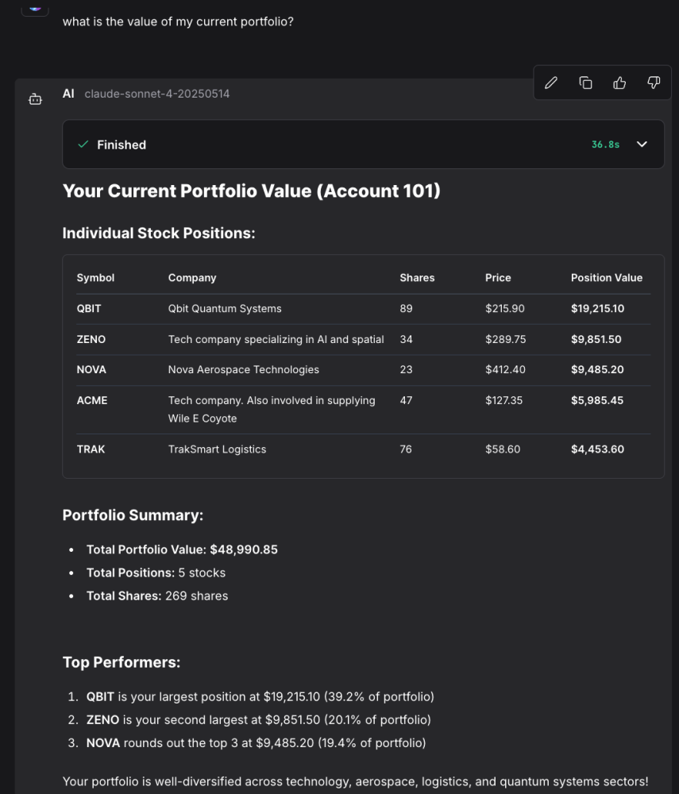

## 5. Oracle Database Vector search

You may have noticed the “If the question asks about details of one or more of the companies the stock represents, do an Oracle vector search on the `PDFCOLLECTION` table to get a description” part of the agent instructions in the MCP section above. Indeed, you are ready to go with vector searches already by just using the MPC server, and below is an example that shows the results of a query that returned both structured data about the number of shares in the portoflio and their value and a longer description of the (fictitious) ACME company that is the result of a vector search on a pdf vectorized/stored in the `PDFCOLLECTION` table:

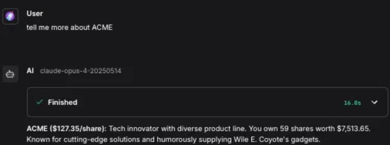

You can alternatively use a Vector Store and Embeddings directly in the Langflow agentic flow. Though they likely will soon, currently, Langflow does not have Oracle-specific components for its Vector Store. However, we have written one that you can see, along with local versions of sentence-transformers for the embedding model, in the “custom components” section below, and of course, it is in the src repos as well. You can simply copy and paste them into the Langflow install as described, and you’ll be able to see and add them (“Oracle Database Vector Store” and “Oracle Database Local Embeddings”) from the components menu on the left, as you have with other components.

Here is what the flow looks like. Notice we expose the Number of Results (k) as one of the options along with the option to cache, etc., and you can modify and expand on this if you like... You do not need to specify anything for “ingest data” if you have vectorized and stored your embeddings already.

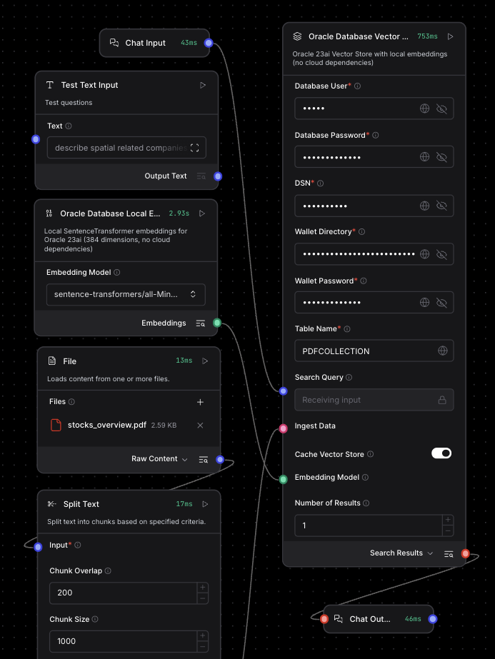


Running this flow, you see results like this:

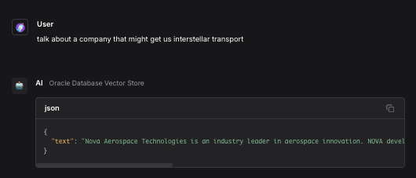


## 6. Oracle Database 26ai NL2SQL/ “Select AI”

There are many ways to go about implementing agentic flows, and a guiding light is almost always to try to bring the AI to the data. Oracle Database NL2SQL/”Select AI” takes natural language queries and converts them to SQL on the database side, and thus follows this best practice.

You specify meta on the database side to help the LLMs with context via comments and annotations like so:

```sql
COMMENT ON TABLE ADMIN.STOCKS IS 'Information about stocks such as symbol and description of company and sector';


COMMENT ON TABLE ADMIN.PORTFOLIO IS 'Information about stocks owned in portfolio including the count and current market price';
COMMENT ON TABLE ADMIN.PORTFOLIO_STOCKS IS 'Information about stocks owned in portfolio including the count and current market price and information about stock such as symbol and description of company and sector';
```

Now, let's give network access privileges to our database user:

```sql
-- Grants EXECUTE privilege to ADB_USER
GRANT EXECUTE on DBMS_CLOUD_AI to ADB_USER;

--Grants EXECUTE privilege DBMS_CLOUD_PIPELINE to ADB_USER
GRANT EXECUTE on DBMS_CLOUD_PIPELINE to ADB_USER;
BEGIN
        DBMS_NETWORK_ACL_ADMIN.APPEND_HOST_ACE(
             host => 'api.openai.com',
             ace  => xs$ace_type(privilege_list => xs$name_list('http'),
                     principal_name => 'ADMIN',
                     principal_type => xs_acl.ptype_db)
       );
END;
/
```

We will use OpenAI models with Select AI. For that, let's create the necessary credentials for the LLM we will use; as well as creating the profile, specifying which tables, views and indices the profile has access to, etc.:

```sql
-- create credential
BEGIN
  DBMS_CLOUD.CREATE_CREDENTIAL (
      credential_name  => 'OPENAI_CRED',  
      username         => 'OPENAI',       
      password         => 'youropenaikey'     
  );
END;
/
-- give permission to our objects, and configure hyperparameters:
BEGIN
  BEGIN
    DBMS_CLOUD_AI.drop_profile(profile_name => 'OPENAI_PROFILE');
    DBMS_OUTPUT.put_line('Dropped existing OPENAI_PROFILE');
  EXCEPTION
    WHEN OTHERS THEN 
      DBMS_OUTPUT.put_line('No existing OPENAI_PROFILE to drop');
  END;
  DBMS_CLOUD_AI.create_profile(
    profile_name => 'OPENAI_PROFILE',
    attributes   => '{"provider": "openai",
                      "credential_name": "OPENAI_CRED",
                      "model": "command", 
                      "temperature": 0.1,
                      "max_tokens": 4096,
                      "object_list": [
                        {"owner": "ADMIN", "name": "STOCKS"},
                        {"owner": "ADMIN", "name": "PORTFOLIO"},
                        {"owner": "ADMIN", "name": "PORTFOLIO_STOCKS"}
                      ],
                      "comments": "true"}'
  );
  DBMS_OUTPUT.put_line('Created OPENAI_PROFILE');
END;
/
```

Then, we can try some queries using this newly-created profile:

```sql
-- where action can be "narrate", "showsql", "runsql", "explainsql" 
SELECT DBMS_CLOUD_AI.GENERATE(
                prompt       => :prompt,
                profile_name => 'GENAI',
                action       => :action)
            FROM dual;
```

Here are the available actions and what each of them do:

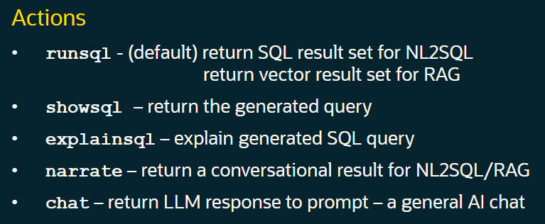

For example, if I want it to narrate the results of the following query, I'll use the following command:

```sql
SELECT DBMS_CLOUD_AI.GENERATE(
                prompt       => 'what is the value of my portfolio?',
                profile_name => 'OPENAI_PROFILE',
                action       => 'NARRATE')
            FROM dual;
```

Since everything is set up on the server/database side, you can just use it from Langflow by calling SQL directly or using the MCP server and simply instruct the agent to do something like “If a question is related to stocks or portfolio, use the DBMS_CLOUD_AI.GENERATE procedure, passing in the prompt, as-is without any alterations, using an action of ‘narrate’, and profile_name of ‘investments’.

Easy and powerful, and it has an amazing roadmap ahead as well.

## 7. Oracle AI Optimizer and Toolkit

The [Oracle AI Optimizer and Toolkit](https://github.com/oracle/ai-optimizer) provides an environment where developers and data scientists can explore the potential of GenAI combined with RAG capabilities. By integrating Oracle Database 26ai AI VectorSearch and soon SelectAI and MCP, the Sandbox enables users to tweak their models and usage. The optimizer has a GUI and is exposed as an endpoint, so we can call it from Langflow. Here is a screenshot of the GUI (this particular screen being of the very useful testbed):

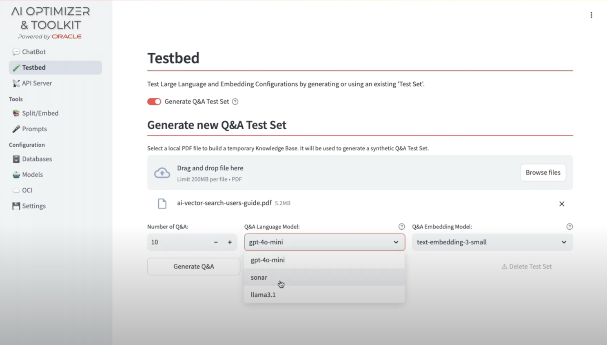


Since it is accessible as an API, you can simply use the Langflow “API Request” component and enter the appropriate URL, headers, request, etc. — super easy. Here, we additionally use a local model to tweak and structure the body/request.

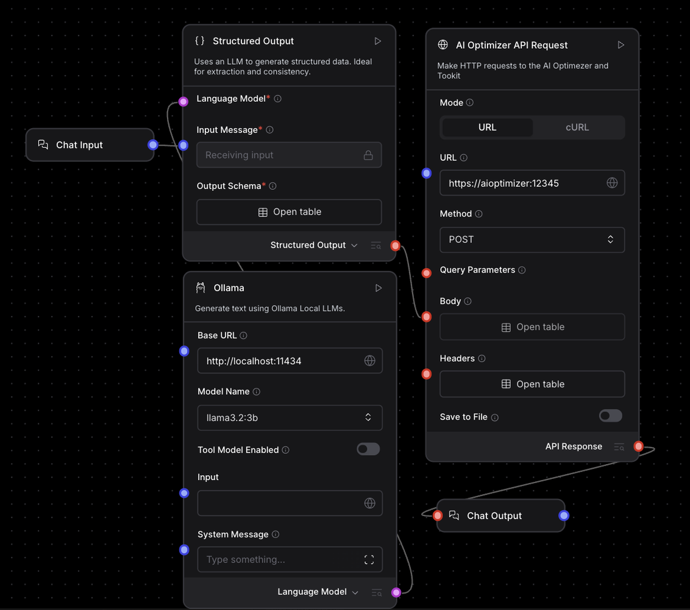


You can see and use the latest headers, body, etc., using the AI Optimizer doc, but to give you the idea:

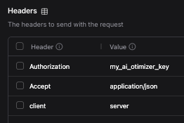


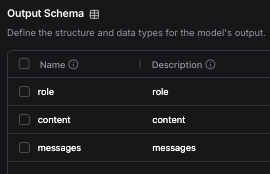


## 8. Playground, Share API

In the upper right, you can try the agentic flow via the playground or by sharing it as an API or even MCP server itself…

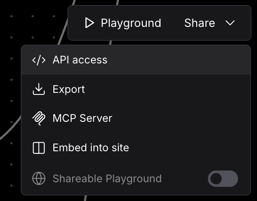

You can expand the steps in the playground to see the chain of thought and actions that are being taken in detail. For example, ask”What is the total value of my portfolio?” — This uses the MCP server to get the number of stock owned and current market value, and then uses the calculator tool to come up with the full value.

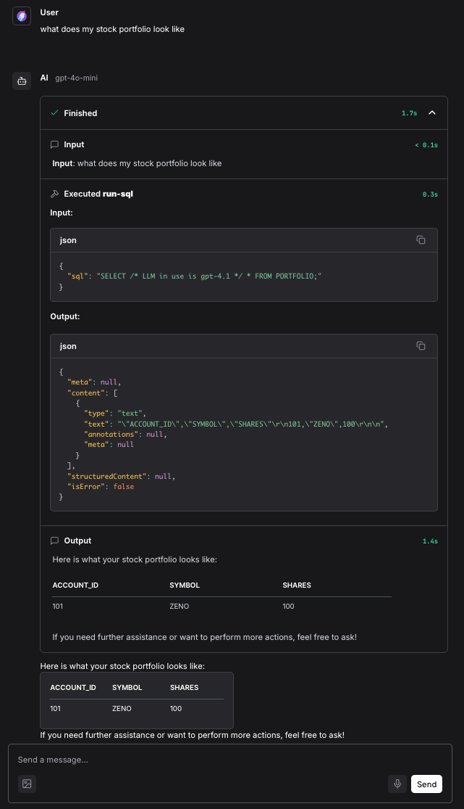

## 9. Interactive AI Hologram Agents

In this chapter, we will hook these Langflow agentic flows up to the Interactive [AI Holograms activation](https://www.linkedin.com/pulse/interactive-ai-holograms-develop-digital-double-oracle-paul-parkinson-zdpjf/).

You can ask things like “I’d like to speak to a financial advisor” or “Show me a digital twin of the airport” and a metahuman hologram of the appropriate agentic system will appear and answer your questions with verbal and visual responses.

This was first demoed at the `ai4` conference in 2025, [check out this video](https://www.youtube.com/watch?v=mXf0XmbtbNI) for more information.

## 10. Langflow Custom components (for Oracle Database 26ai)

Langflow has many components for models, vector stores, tools, etc., and also allows you to add custom components. Currently, there is no Oracle-specific component built into Langflow; therefore, we have written one for you, and regardless, it is good to know as they are easy to write and convenient to use.

Take a look at this Langflow Vector Store custom component written for Oracle Database, where you can see the inputs and outputs, in [this file](./components/vectorstores/oracledb_vectorstore.py):

There's also a local SentenceTransformer embedding component available (which includes the `all-MiniLM-L12-v2` SentenceTransformers model). You can find it in [this file](./components/vectorstores/local_sentencetransformer.py).

In most cases, you don't need to modify the `__init__.py` file in the [components](./components/) directory, but if you need to, simplify follow these guidelines:

```python
# ...  other imports
from .local_sentencetransformer import LocalSentenceTransformerComponent

__all__ = [
# other components
    "LocalSentenceTransformerComponent",
#  other components
]
```

> **Note**: the name of the directory you store these custom components in is the way they will appear in Langflow, eg “VectorStores”, “Embeddings”, “MyCustomComponentType”. You point Langflow to the parent directory of these customer component directories by exporting the locations as LANGFLOW_COMPONENTS_PATH, however, short story is, this sometimes doesn’t work and so you may need to copy it directly into the Langflow dir like this:

```bash
cp ./mylangflowcomponents/embeddings/local_sentencetransformer.py langflowenv/Lib/site-packages/langflow/components/embeddings/

cp ./mylangflowcomponents/vectorstores/oracle_vectorstore.py langflowenv/Lib/site-packages/langflow/components/vectorstores/
```

After doing this and (re)starting Langflow, you should see your custom components for Oracle Database Vector Store and SentenceTransformer Embedding (for vectorizing PDF, etc., docs)

## 11. Using local or non-default model providers (eg Ollama) for AI Agents in Langflow

To use a Language Model/Provider that is not in the “Model Provider” list of the Langflow agent, simply select “Custom” under the drop-down:

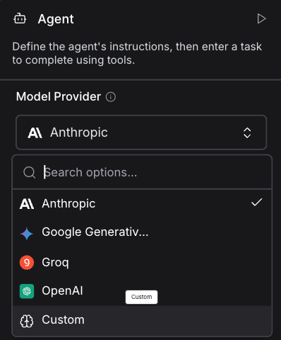


The “Model Provider” menu will turn to “Language Model” and if you click the input circle to the left the Components menu on the left will automatically filter to models (or of course you can simply search for one):

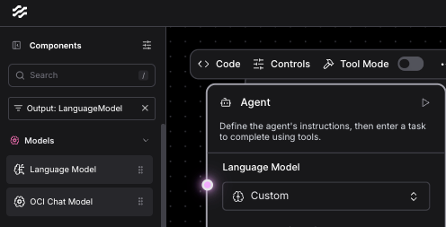

Enter the Base URL and Model Name and wire the Language Model into the Agent. An example for using locally run Ollama on http://localhost:11434 is show here:

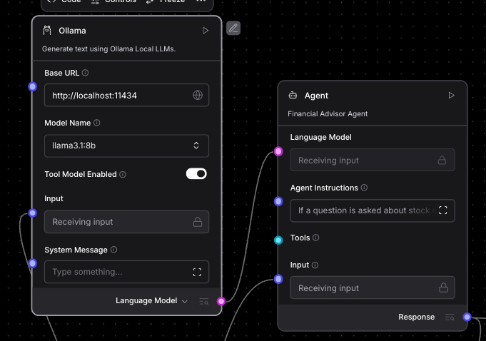

Notice the “Tool Model Enabled” mode. This filters the models that can actually be used for/by tool calling (not all models can)


## Conclusions

That’s all for now! Thanks for reading, let me know if you have any questions or feedback, and again, this is all built around **Oracle Database 26ai**, which you can run for free either on cloud or container, ready to run with Kubernetes. [Click here to try.](https://www.oracle.com/database/free/)
