# Chat With Your Personal Files: A Real-Life Example of Using LangGraph and Oracle Generative AI to Summarize, Index, and Find Files Instantly. 


We all know the frustration of searching endlessly for a document you know exists somewhere in your personal files. Traditional search often relies on exact file names or rigid folder structures, making it difficult to quickly find what you need. But what if you could simply chat with your documents and instantly locate the right file—summarized, indexed, and ready to use?

In this article, I’ll share a real-life example of how I built a solution that does exactly that. By combining **LangGraph** with **Oracle Generative AI** and **Oracle Database 23ai**, I created an intelligent system that automatically extracts metadata, generates concise summaries, and indexes file contents for easy retrieval. The result is a conversational agent that transforms how we interact with our personal data: instead of searching through folders, you ask questions in natural language and the system finds the right document for you.

>**Note**: This agent is intended for file search only. It does not have the ability to answer in-depth questions regarding the content of your files, as it can only access the summary of each document.  

# File Indexing: Discovery what your files are about

This blog demonstrates how to index PDF, Images, DOCx or TXT files using Python code, Generative AI models and Oracle 23ai database

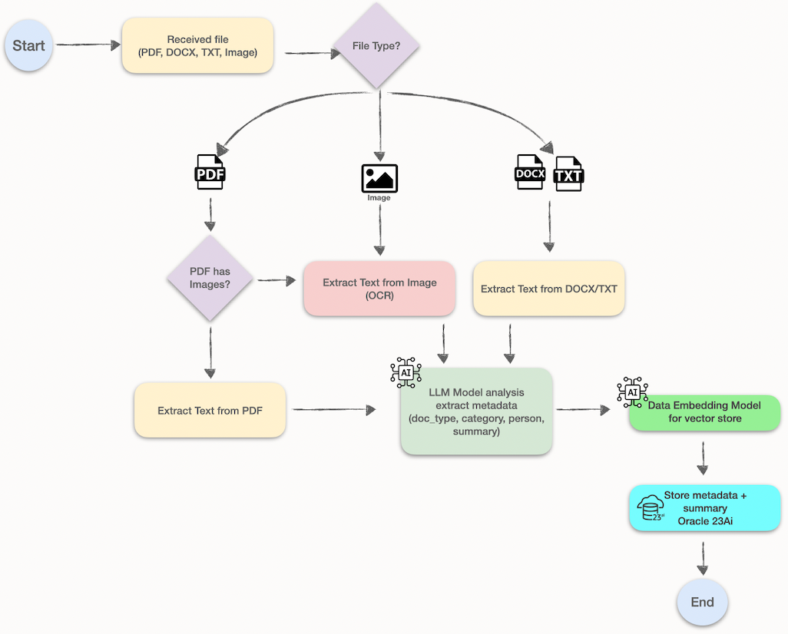


>**IMPORTANT**: This blog is designed solely for educational and study purposes. It provides an environment for learners to experiment and gain practical experience in a controlled setting. It is crucial to note that the security configurations and practices employed in this lab might not be suitable for real-world scenarios.
>
> Security considerations for real-world applications are often far more complex and dynamic. Therefore, before implementing any of the techniques or configurations demonstrated here in a production environment, it is essential to conduct a comprehensive security assessment and review. This review should encompass all aspects of security, including access control, encryption, monitoring, and compliance, to ensure that the system aligns with the organization's security policies and standards.   
>
> Security should always be a top priority when transitioning from a lab environment to a real-world deployment.  


## Technologies powering this solution  
  - [Oracle Autonomous Database 23ai](https://docs.oracle.com/en-us/iaas/autonomous-database-serverless/doc/autonomous-intro-adb.html#GUID-8EAA5AE6-397D-4E9A-9BD0-3E37A0345E24) : Oracle 23ai is a converged database that seamlessly combines advanced vector search with proven relational capabilities, enabling AI-driven and traditional workloads in a single platform.     
  - [LangGraph](https://github.com/langchain-ai/langgraph) : LangGraph is a low-level, stateful orchestration framework for building and managing long-running AI agents and complex multi-agent workflows using graph-based architecture 
  - [OCI Generative AI Services](https://docs.oracle.com/en-us/iaas/Content/generative-ai/getting-started.htm): OCI Generative AI is a managed service offering customizable LLMs for chat, text generation and summarization.  
  - [Sentence Transformers](https://pypi.org/project/sentence-transformers/): The sentence-transformers package is a Python framework designed for creating and working with embeddings—dense vector representations of text that capture semantic meaning. Built on top of PyTorch and Hugging Face Transformers, it simplifies the process of encoding sentences, paragraphs, or documents into fixed-size vectors suitable for a wide range of Natural Language Processing (NLP) tasks.  


## Prerequisites - Oracle Cloud Infrastructure

 - Oracle account with admin level access permissions, if not admin level then apply the needed policies [Getting Access to Generative AI](https://docs.oracle.com/en-us/iaas/Content/generative-ai/iam-policies.htm)
 - Oracle CLI installed on your local machine, see details here: [Installing the CLI](https://docs.oracle.com/en-us/iaas/Content/API/SDKDocs/cliinstall.htm)
 - Oracle Autonomous Database 23ai, see details here: [Provision an Autonomous Database Instance](https://docs.oracle.com/en/cloud/paas/autonomous-database/serverless/adbsb/autonomous-provision.html) 
 
 - Python 3.12.10 installed, you can find more details here [Simple Python Version Management: pyenv](https://github.com/pyenv/pyenv) 
 - OpenGL libs installed on your machine, if you're using Oracle Linux, you can install by running the command:
   ```
    # Install OpenGL 
    sudo dnf install -y mesa-libGL
   ```
 

## Quick Start  

1. Collect all database needed information:  

    1.1 - Go to your autonomous Oracle 23ai database, click on **Database Connection** and then click on **Download Wallet**.
      >**Note** Take note of your database wallet password!   

    1.2 - Click on **Storage**, under **Object Storage & Archive Storage** click on **Buckets**, then create a new bucket to store your database wallet, then upload the downloaded wallet zip file.  
      >**Note** Take note of your namespace, bucket name and wallet zip file name. 


    1.3 - Collect all that information and make a note of it — we’ll need it later.  

    | Variable |  Value | Description | 
    |----------|--------|-------------------------------|
    | DB_USER  | "admin"| The administrative database username |
    | DB_PASSWORD | "xxxxxx" | Your database password | 
    | DB_DSN  |  "xxxxxxx" | Get the database service name from your tnsnames.ora, ie. yourdatabase_low | 
    | WALLET_PASSWORD | "xxxxxxxx" | Get your wallet password | 
    | OCI_BUCKET_NAMESPACE | "your bucket namespace" | The namespace of your created bucket |
    | OCI_BUCKET_NAME_WALLET | "your bucket name" | Your bucket name |
    | OCI_WALLET_OBJECT_NAME | "your wallet zip file name" | The name of your database wallet zip file | 
    | OCI_COMPARTMENT_ID | "your compartment OCID" | Get your compartment OCID |  

    > **Note** The tnsnames.ora file can be found inside the Wallet zip file.  


  
2. Let's start indexing the files  
  2.1 - On your shell machine, get the code and create your .env file 
    ````
    git clone https://github.com/oracle-devrel/devrel-labs.git
    cd langgraph_agent_with_genai/src
    ## Create your .env file from the template
    cp .env_template .env 
    ```` 

    2.2 - Setting your values for the environment variables on **.env**  
    > **Note** Edit the .env file using your preferred text editor and fill the information with your collected values from **step 1**  
  
    ``` 
    cat .env 

    OCI_CLI_PROFILE=DEFAULT 
    DB_USER="admin"
    DB_PASSWORD="xxxxxxx"
    DB_DSN="myrdbms_tp"
    WALLET_PASSWORD="xxxxxxx"
    OCI_BUCKET_NAMESPACE="xxxxxxxx"
    OCI_BUCKET_NAME_WALLET="my-bucket"
    OCI_WALLET_OBJECT_NAME="Wallet_MyRDBMS.zip"

    OCI_COMPARTMENT_ID="ocid1.compartment.oc1..xxxxx"

    #meta.llama-3.2-90b-vision-instruct
    OCI_GENAI_IMAGE_MODEL_OCID="ocid1.generativeaimodel.oc1.sa-saopaulo-1.amaaaaaask7dceyalwceqwzlywqqxfzz3grpzjr42fej5qlybhu2d666oz4q"
    OCI_IMAGE_MODEL_ENDPOINT="https://inference.generativeai.sa-saopaulo-1.oci.oraclecloud.com"

    #meta.llama-3.3-70b-instruct
    OCI_GENAI_ENDPOINT="https://inference.generativeai.sa-saopaulo-1.oci.oraclecloud.com"
    OCI_GENAI_REASONING_MODEL_OCID="ocid1.generativeaimodel.oc1.sa-saopaulo-1.amaaaaaask7dceyarsn4m6k3aqvvgatida3omyprlcs3alrwcuusblru4jaa"

    ```
    > **IMPORTANT**: This sample code was validated using models available in the **sa-saopaulo-1** region. Model availability may vary across regions; please refer to the documentation for the latest details.  
    You can find more information here [Pretrained Foundational Models in Generative AI](https://docs.oracle.com/en-us/iaas/Content/generative-ai/pretrained-models.htm#pretrained-models).   
    **If you use different models, you will need to adjust the distance threshold on the search agent.**  


    We use different models for each requirement:
      - OCI_GENAI_IMAGE_MODEL_OCID: This is used to extract text from images (OCR), you must choose a **Multimodal** model. 
      - OCI_GENAI_REASONING_MODEL_OCID: This is used as LLM generation and understanding of the extracted text. 


    
    2.3 - Initialize the database table on Oracle 23ai  
    Run the **init_database.py** script that will create the table. 

    ```
    ls -lrt 
    # Make sure you install all needed python dependencies.  
    pip install -r requirements.txt 
    python --version 
    python init_database.py
    ```

    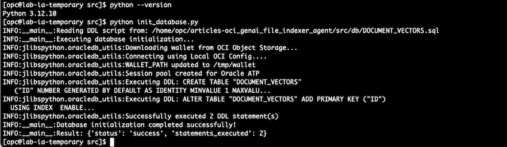
  

    2.4 - Run the IA file indexing. 

    > **Note**: For demonstration purposes, sample files have been created to support tool validation. These files simulate real documents, including lab test requisitions and results, a Brazilian driver’s license, and Brazilian invoices and receipts.  
    The files are located on ./samples directory. 

    ```
    python batch_process_samples.py

    ```
    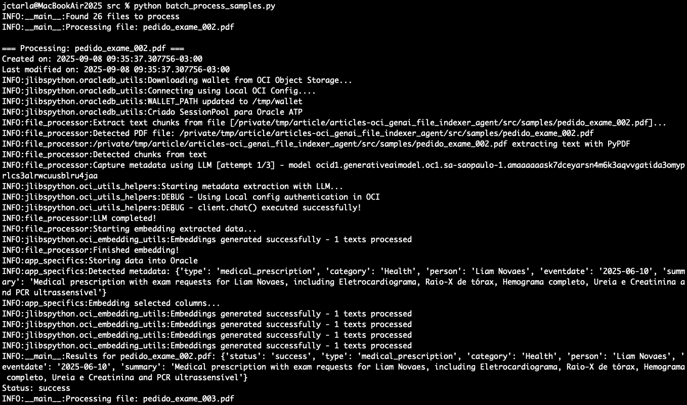
    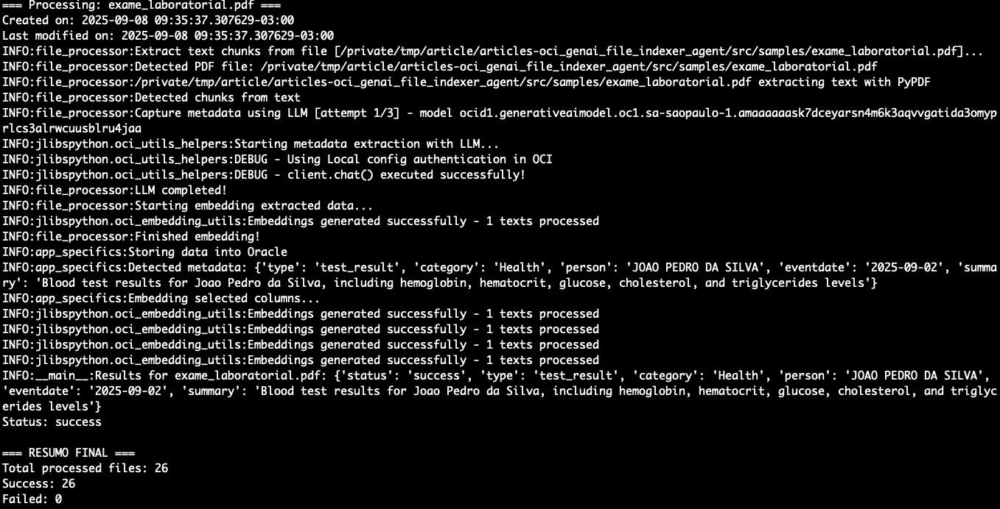  

    The sample files from **samples** directory are now successfully indexed and stored your Oracle 23ai database.
  
    2.5 - Let's validate our indexed data (this is not our Search Agent).  
    To validate the data, run the **validation.py** script. This script verifies the loaded data and checks the distances returned by the model when querying specific columns. The results can be used to confirm and refine the distance thresholds applied in the Search Agent.  

    ````
    python validation.py
    ````
    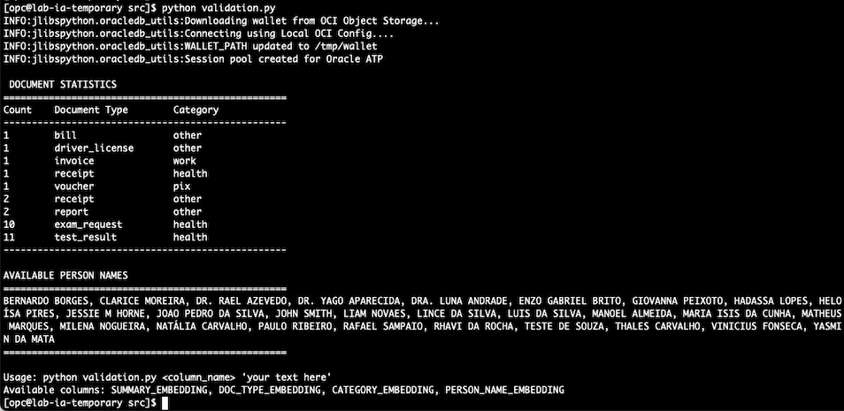  

    ````
    python validation.py PERSON_NAME_EMBEDDING "heloisa pires" 
    ````
    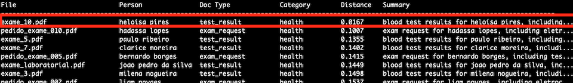  

    > **Note**: As we can see, a simple query for person name using vector search return a very close distance, which means our model is running as expected.  

<br>
<br>

# AI Agent Search: Chat with your files  

  The agent is designed to perform file retrieval based on both document summaries and associated metadata. Users can submit natural language queries about their files, and the agent will intelligently process the request to identify and return the most relevant documents.  

      
  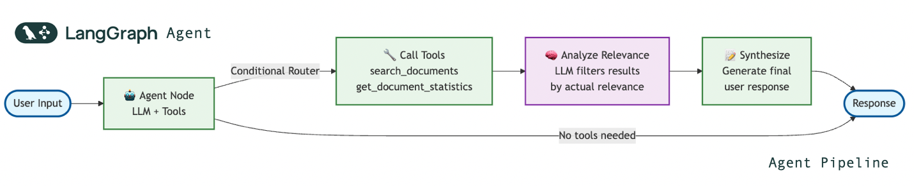  
  
  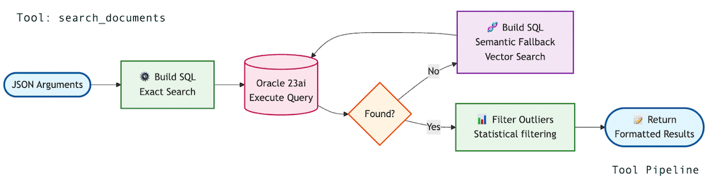  
  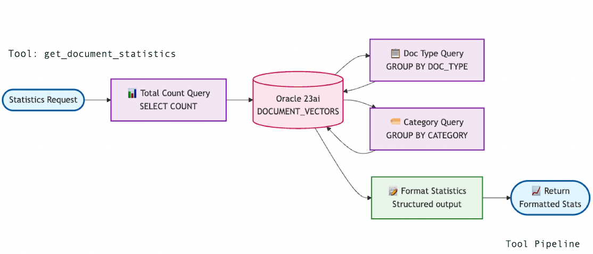  


<br>  


  ### Key Code Snippet: Leveraging OCI Generative AI in the Agent  
  
  ⚠️ **Warning**  
  When working with LangChain on OCI, make sure you use the official Python package **langchain_oci**. Many users get confused because there is also a community ChatOCIGenAI class, which is depreacated and should not be used, for more information, check [langchain_oci.](https://docs.public.content.oci.oraclecloud.com/en-us/iaas/Content/generative-ai/langchain.htm) 

  The following snippet demonstrates the code currently used in this blog.  

  ``` 
   # This is the correct package used in this agent
   cat requirements.txt |grep langchain-oci==0.1.3
  ```


  ``` 
  .
  .
  .
  from langchain_oci.chat_models import ChatOCIGenAI

  llm = ChatOCIGenAI(
    model_id=model_id,
    service_endpoint=endpoint,
    compartment_id=compartment_id,
    auth_type="API_KEY",
    model_kwargs={"temperature": 0.2, "max_tokens": 1000}
)

  ```


  ### Run the agent, by running **AgentChat.py** script and start asking questions...

  ```
  python AgentChat.py 
  ```  
  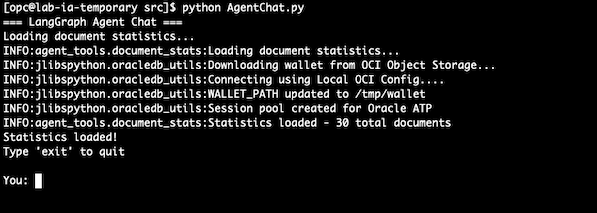  

  Let's try with a initial question: "**I need a document that is about receipt of physiotherapy**" 

  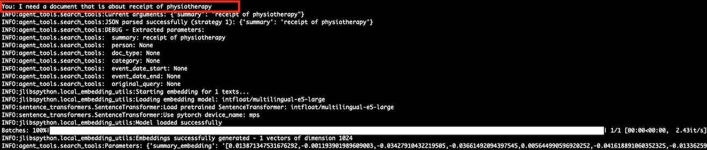  
  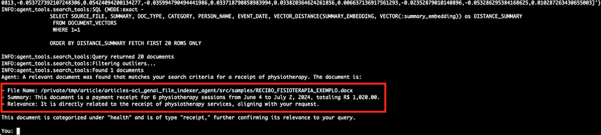  
  
  ### Playing with questions:  
  
  - **"Which documents talk about brazilian beaches?"**  
    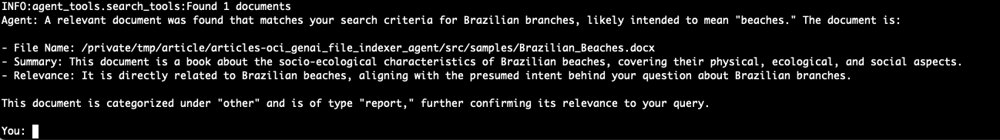  

  - **"List test results from August 2025"**  
    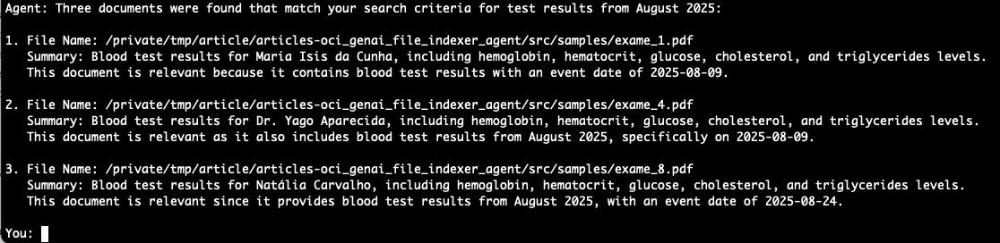  
  
  - **"List receipts that are from physiotherapy"**  
    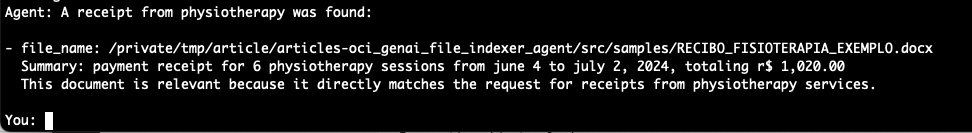  

<br>  

**Conclusion**  


This project demonstrates how combining LangGraph, Oracle Generative AI, and Oracle Database 23ai can transform the way we interact with our files—making search faster, smarter, and more intuitive. While the implementation here focuses on document indexing and retrieval, the same principles can be extended to many other real-world scenarios. By experimenting with additional tools, refining thresholds, and expanding metadata extraction, you can evolve this agent into a powerful foundation for building AI-driven knowledge management systems. The journey does not end here—this is just the starting point for reimagining how we connect with our data.  
